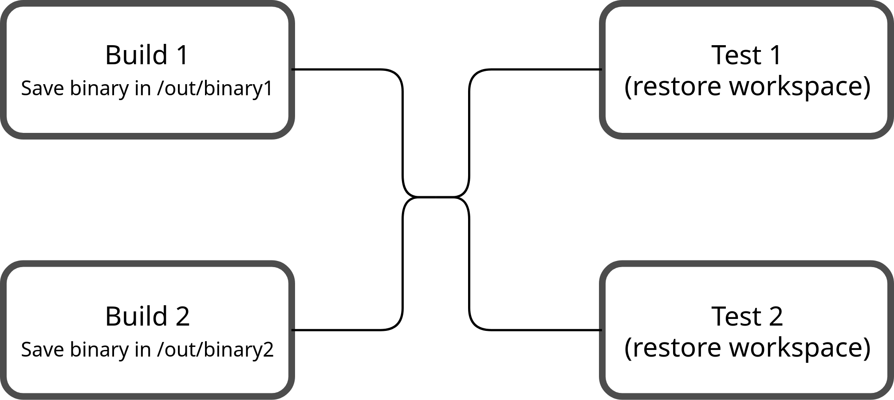

# Run Workspace

Every Run has an associated workspace. The workspace is unique for every Run. But port it its "layers" will be reused when you restart a run from failed tasks.

A workspace cannot just be a simple "shared" directory between tasks for many reasons:
* tasks can be executed in parallel on different executors (and also on different architectures)
* Restarting a run from the failed tasks won't be possible since the "shared" directory will contain dirty contents caused by a failed task.

Instead, a workspace is conceptually a "tree" of layers. When a task wants to save something to the workspace it'll use the `save_to_workspace` step.

When a task want's to restore a workspace it'll use the `restore_workspace` step.

## Workspace restorations

A workspace is restored extracting all the files saved by every parent task starting from the root parent tasks until the direct parent. Files saved from a task that is not an ancestor of the current task won't be restored.

A task may have multiple parent tasks in such case the order of the related workspace layer extraction is undetermined.

Currently if the same file has been saved multiple times in differents tasks the workspace restoration will fail (or it'll cause unpredictable behaviors and will break the rule of workspace and Run reproducibility). In future the logic could be improved to permit overwriting a file from a parent task.

If in a previous parent a path was saved as a directory and later it's saved as a file (or viceversa), workspace restoration will fail.

## Examples

### Multiple isolated tasks

In this example there're two parallel builds for different architectures and related tests. There're not dependencies between the two different architectures build/tests

When `Test x86_64` restore the workspace it'll only restore the files generated by `Build x86_64` (`/out/binary`)

### Multiple dependant tasks

In this example there're two parallel builds for different binaries, the tests tasks (`Test 1` and `Test 2`) depenends on both builds.

When `Test 1` and `Test 2` restore the workspace they'll restore the files generated by both `Build x86_64` and `Build arm64`. Note that the build steps saved the files under different paths so `Test 1` and `Test 2` will restore two files (`/x86_64/binary` and `/arm64/binary`).

If the build steps saved the binary under the same path (like in the previous example), workspace restoration will fail since the same file is going to be restored two times with unpredictable behavior.