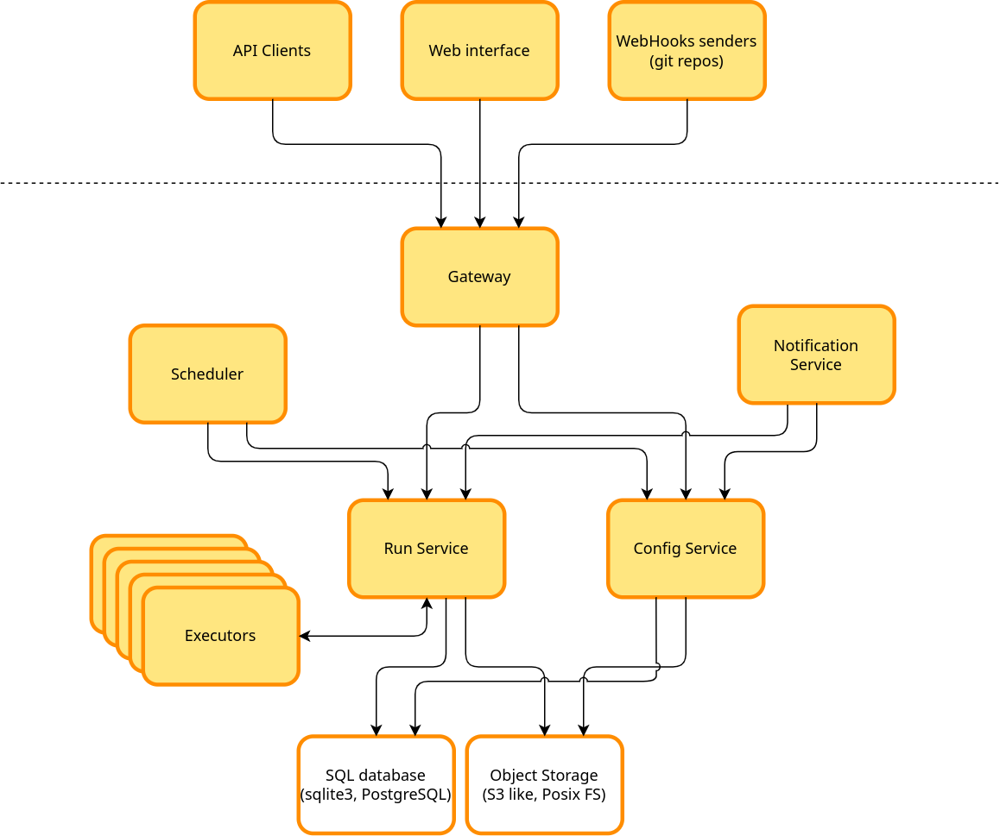

# Architecture

Agola is composed of multiple (micro)services

Every service does one part of the big job and permits to create additional extensions by creating additional services that interacts with them

## Services

#### Internal services

The **Run**, **Config**, **Scheduler** services are internal services and their API are used by the other service but must not be exposed to external users since they are open (not authorization handling)

#### User facing services

The **Agola gateway** is the user facing endpoint. They interact with the internal services and manages authorization (and also receive webhook request from remote sources)

### Gateway

The API entry point for external client and webhooks.

- Handles authentication and authorization
- Entities configuration (create/manage organizatios, projects etc...)
- Run management:
  - restart a run
  - authorize a run or a run task

### Run Service

The **Run service** manages and execute runs. A run is a group of tasks. Each task can depend on another task to achieve fan-in and fan-out

See [Run Service](./runservice.html) for a detailed description.

### Config

Stores the configurations of the various agola entities types:

- Organizations
- Users
- Project
- Project Group

### Scheduler

The **Scheduler** will monitor queued/running/finished runs and start queued runs applying the specific project/organization limits and configuration.

Some Examples:

- Only one running run per project (useful for deployment runs where concurrent deployments may create issues):
  - Start next queued runs only when there're no running runs
- Only one running run per project and cancel/stop current ones:
  - When a new run for a project/branch is queued, **STOP** all running runs, and **CANCEL** previously queued RUNS.
- Have at max N running runs per project/branch

### Notification service

The notification service listens for run events from the run service and publishes commit status updated to the remote sources